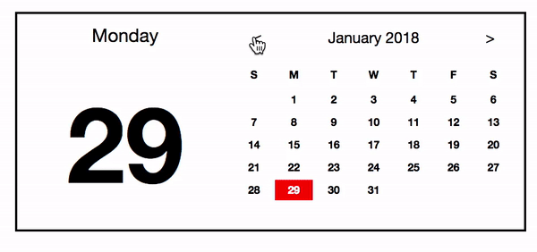
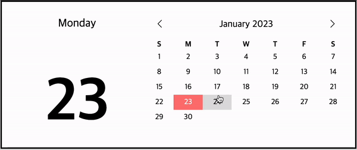

# Calendar

바닐라 자바스크립트로 달력을 만들어봅니다.

## 예시



## 사전 설치 (Setup)

Install dependencies

```sh
yarn
# or yarn install
```

## 작업 방법 (Development)

```sh
yarn start
# Visit http://localhost:1234 from your browser (Chrome)
```

## 요구사항

- [x] 위 이미지의 달력과 기능 및 스타일이 최대한 일치하도록 달력을 만듭니다.
- [x] 과거나 미래의 연도도 보여줄 수 있어야 합니다.
- [x] 날짜를 선택하면 해당 날짜의 스타일이 변경되어 선택됐다는 것을 보여줘야 합니다.
- [ ] 날짜를 선택하면 해당 날짜에 대한 Todo List가 보여져야 합니다.
- [ ] Todo List에 해당 날짜에 대한 Todo Item이 추가하는 기능이 있어야 합니다.
- [ ] Todo List에서 Todo Item을 삭제할 수 있어야 합니다.

## 참고

- 일반적인 사용자 입장에서 테스트해보며 어색한 부분이 없도록 합니다.
- 웹 표준에 맞는 html 태그를 사용합니다.

## 개발 기록

### 1차



- [x] yarn berry + TS 설치
- [x] prettier + eslint 설정 (format on save)
- [x] Vanilla SPA 구조 구성
- [x] 달력 완성

## 과제를 마치면서

### 1. 중점을 두었던 부분

- Vanilla SPA
  - `Component`라는 슈퍼 클래스를 만들어 상속하면서 사용
  - 말단에 있는 컴포넌트는 `template()` 메소드로 html을 렌더링
  - 그 외 컴포넌트들은 상태 전달
  - 이벤트 등록은 최상위의 Page 컴포넌트에서 일괄 등록

- 상태 관리
  - 부모 컴포넌트의 상태를 observe하게 한 후 `setState()` 호출마다 자식 컴포넌트를 렌더링하게 구성하는 것이 최초의 목표
  - 그러나 이 방법은 상태가 어떻게 바뀌었는지, 렌더링을 새로 해야하는 상태인 건지 매번 판단하지 않으면 최적의 렌더링을 하기 어려움
  - 컴포넌트 구조가 단순하기 때문에 부모 컴포넌트의 `setState()`를 자식 컴포넌트의 `setState()`를 일일이 호출하게 오버라이딩해 임시적으로 해결

- UX
  - 날짜 선택
    - 달력을 클릭한 위치가 날짜 사이일 경우, 사용자가 어떤 날짜를 클릭하고 싶었는지 알 수 없음
    - 따라서 `:hover` 효과로 연한 회색의 배경을 주어 클릭할 경우 어떤 날짜가 선택되는지를 명시
  - 오늘 날짜
    - 달력을 오늘을 확인하는 용도로 사용햐는 사람도 있을 것이라는 생각
    - 따라서 오늘 날짜를 노란색으로 따로 표시
    - 달력 상단의 연월 부분을 클릭할 경우, 오늘로 이동하는 기능 추가
  - 이전달 / 다음달 이동
    - 올해의 날짜를 확인하는 것은 크게 불편하지 않으나, 다른 연도를 확인하고 싶으면 상당히 불편함
      - 구현하지는 않았으나 달력 상단의 연월을 클릭했을 때 오늘로 이동하지 않고, 연도를 선택할 수 있는 화면이 나오게 구현하면 해결할 수 있을 것 같음
    - 빠르게 이동할 때 자연스럽기 위해서는 달마다 4주 ~ 6주로 다른 날짜 배치가 동일해야 함
      - 따라서 최대 크기인 6주짜리 테이블은 고정한 채로 내용을 채워 넣는 방식으로 함

### 2. 아쉬운 점

- Component
  - 모든 기능이 담긴 `Component`와 그를 상속해 만든 `Page`까지만 나눴음
  - 그러나 `template()`을 호출하는 곳은 결국 말단의 자식 컴포넌트
  - `setState()`는 말단에서만 html을 다시 렌더링하는 용도로 사용하고, 중간 컴포넌트들은 하위로 상태를 전파하는 용도로 사용함
  - 따라서 예전 리액트의 Presentational and Container 패턴처럼, 말단의 Presenter 컴포넌트와 중간의 Container 컴포넌트로 따로 나눠서 슈퍼 클래스로 만들어 사용했으면 좋았을 듯
    - Dan Abramov는 이 패턴이 필요 없는데 쓰는 걸보고 쓰지 말라고 했던 것이지, 자연스럽게 필요성을 찾는다면 유용하다고 하였었음

- 이전달 / 다음달 이동 버튼
  - 달을 이동하는 버튼과 연월 텍스트를 `MonthController`라는 컴포넌트 한 개에서 처리하게 함
  - 리액트 습관으로, 이정도 단위까지만 컴포넌트를 쪼개놓으면 될 것 같았음
  - 그러나 달을 이동할 때 바뀐 상태에 따라 연월 텍스트만 새로 렌더링하면 되는데 렌더링 단위가 컴포넌트라 버튼도 같이 렌더링되면서 버튼 이미지 로딩에 따른 깜빡임이 보임
  - 컴포넌트를 조금 더 잘게 쪼개서 상태와 관련된 부분만 렌더링되게 했으면 좋았을 듯

- parcel
  - 처음에 주어진 parcel-bundler는 **deprecated**!
  - parcel로 migrate해야 함
  - parcel은 yarn berry 환경에서 typescript를 완전히 지원하지 못하는 것 같음
    - parcel에서 tsconfig을 사용하기 위해서는 몇몇 플러그인을 설치해야 하는데, 플러그인끼리 버전 충돌이 나서 사용할 수 없었음

- Todo List
  - 디자인 예시 없이 간단한 기능 명세만 존재했음
  - 설날에 코딩하기 쉽지 않음
    - Todo List를 기획 및 개발할 시간을 만두를 빚고 전 부치는 데 사용
